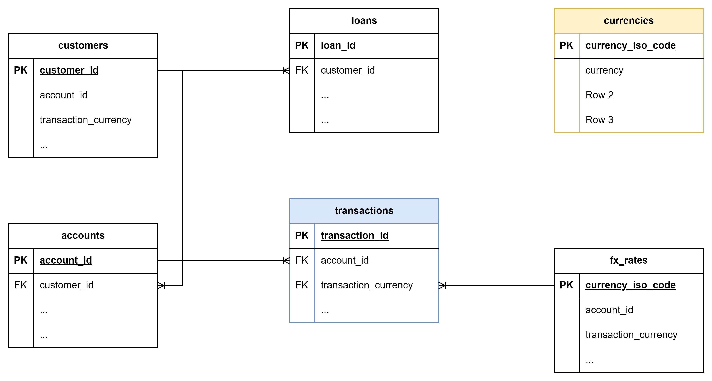

# Case Study at Varengold Bank AG - Data Engineering

## Introduction

Dear applicant,

Thank you for taking your time and agreeing to work on a short case study for us.

In order not to take too much of your time, we have prepared this repository for you. We propose a folder structure and
provide some initial code
snippets as well as a database and one CSV file, that should get you going very quickly. Depending on your
prior knowledge, we estimate a working effort of
1h - 4h.

The goal of this test is to evaluate your understanding of SQL, dbt and data modeling concepts.

Once you feel ready - please not later than one day before your second interview - send us a link to your own
repository. In the interview, you will guide us briefly through your work. Your participation is very much appreciated!

In case you have any problems, questions or feedback, please don't hesitate to approach us right away.

Good luck and have fun,

Your Varengold data team

[Contact us](mailto:d.maas@varengold.de)

### Prerequisites

- Docker
- Your favorite IDE
- Git

## Case Study

We have a small, normalized data model that contains data about our customers, their accounts and loans, as well as
their transactions in various currencies. The data is artificially and randomly generated. For our case study, we assume
that the data comes from a source database every day and lands in our data warehouse (duckdb: raw). We take this source
and want to load it for our purposes into a data warehouse (duckdb: other schemas). On the way we would like to enrich
our data (./data/currencies.csv), ensure correct data types, enforce relations, keep data quality in check and do
further transformations. We have started our work already (./transformations/models/staging). This is where we need your
help...

<details>
<summary> <b> Tasks: </b> </summary>

**Setup:**

1. [ ] Please create a repository and commit this content (or clone and change remote)
2. [ ] Start running the devcontainer and set up your remote connection

**Implementation notes:**
- Repository cloned, changed remote and initialized in a devcontainer for isolated, reproducible development. Connection was set up using DBCODE.

**Exploration:**

- [ ] Please showcase an exploration of the provided data and your findings

**Implementation notes:**
- see vt_casestudy_overview

**Data Loading / Transformation:**

- [ ] Please load the provided CSV file to enrich our data
- [ ] Please create a materialized table into the reporting schema, that sums up all transactions in EUR (Euro) per
  customer, account, branch and date. To simplify everything, the provided exchange rate table should be used for all
  dates.

**Implementation notes:**
- The `import_seed.py` was used to create the `currencies.csv` file in the `seeds` folder. After that, `currencies.csv` was loaded as a dbt seed with correct delimiter and encoding settings using `dbt seed`. 
- Two reporting models were created in the reporting schema: one with account_id (fct_transactions_eur_daily) and account_type (out_fct_transactions_eur_daily). They're identical though.

**Data Quality / Testing:**

- [ ] Please make use of tests. Use dbt's testing functionality to ensure integrity of your models and check for data anomalies.

**Implementation notes:**
- All tests can be run with:
  ```sh
  dbt test
  ```
  see vt_casestudy_overview for more info 


**Data Catalog:**

- [ ] Please generate a data catalog

**Implementation notes:**
- dbt data catalog is generated and served with:
  ```sh
  dbt docs generate
  dbt docs serve
  ```
 To explore the catalog, use: http://localhost:8080.

**Submission:**

- [ ] Please send us a link to your repository

</details>

### Evaluation Criteria:

- Completeness of data exploration, especially finding all anomalies
- Data model and correctness of reporting table
- Robustness of tests and validations

### ERD (DuckDB: raw)

The entity-relationship diagram shows how the individual source tables are related to each other.



